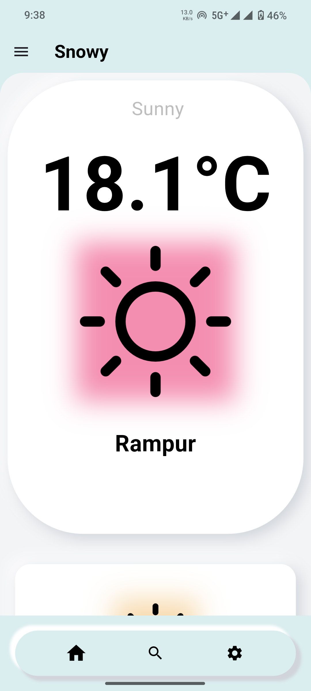
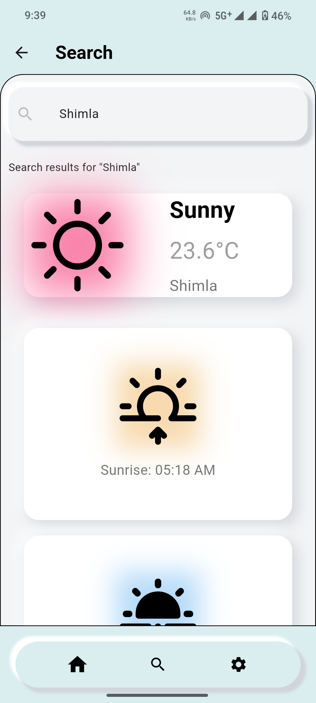
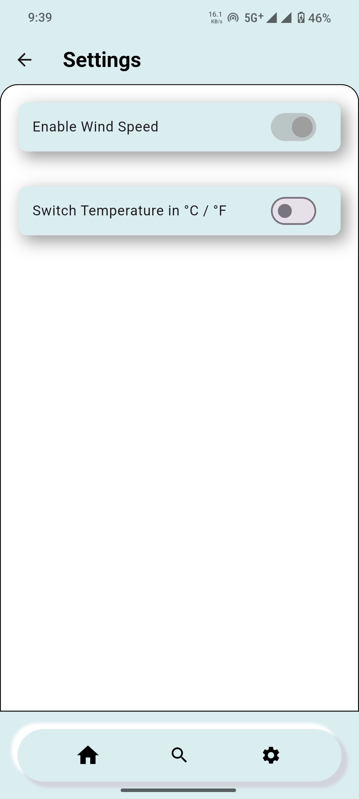
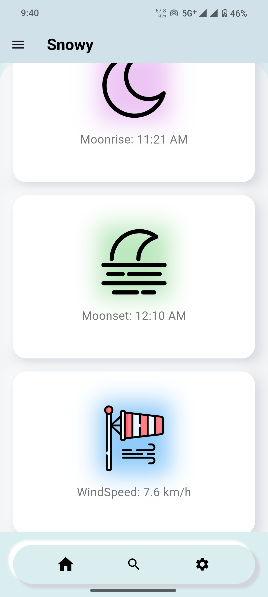

# 🌤️ WeatherZen

**WeatherZen** is a beautifully designed Flutter weather app that combines aesthetics with accurate real-time data.  
Made with love and care, it brings you a relaxing weather-checking experience — from sunrise to snowstorm.

---

## ✨ Features

- 🌡️ Real-time weather updates  
- 📍 Location-based weather info  
- 🌄 Aesthetic, soft UI with neumorphic design  
- 📊 Clean layout for forecasts and details  
- 🔍 Simple search bar to look up any city

---

## 📸 Screenshots

| Home | Search | Settings | Detail |
|:----:|:------:|:------:|:-------:|
|  |  |  |  |

---

## 📥 Download APK

Want to try it out?  
👉 [Click here to download the APK](https://drive.google.com/file/d/1dBXlX8z4icY-fkv4S4aFA9Dg1LStThwW/view?usp=sharing)

---

## 🚀 Getting Started (For Developers)

```bash
git clone https://github.com/akira2552007/snowy.git
cd snowy
flutter pub get
flutter run
